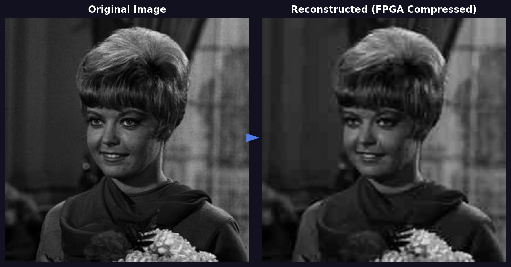

# Zynq DCT Compression IP

AXI4-Lite custom IP core on Zynq-7000 (ZedBoard) implementing a hardware JPEG-like image compression pipeline in Verilog. The ARM Cortex-A9 PS feeds 8×8 pixel blocks to the PL via memory-mapped registers, and a Python host script reconstructs the image from RLE-encoded data received over UART.

---

## Pipeline

```
Input (8×8 block)
    │
    ▼
2D Forward DCT          ← Integer-scaled, two-pass (row-wise → column-wise), 128 cycles
    │
    ▼
Zigzag Scan             ← JPEG-standard 64-element reordering
    │
    ▼
Quantization            ← JPEG luminance Q-table, fixed-point reciprocal multiply
    │
    ▼
RLE Encoding            ← Run-length encoding with EOB marker
    │
    ▼
PS reads back via AXI   ← ARM polls REG_STATE, reads REG_RLE_DATA entries
    │
    ▼
UART → Python host      ← Dequantization + IDCT → reconstructed.png
```

---

## Repository Structure

```
zynq-dct-compression-ip/
├── Design/
│   ├── myip_DCT_v1_0_S00_AXI.v   # AXI4-Lite IP core (Verilog RTL)
│   ├── Block_Design.tcl            # Vivado block design recreation script
│   ├── Project.tcl                 # Vivado project recreation script
│   ├── main.c                      # Vitis C application (ARM PS driver)
│   └── python_code.py              # Host-side UART receiver + image reconstruction
├── input_test_image.png            # 128×128 greyscale test image
├── output_comparison.png           # Original vs reconstructed comparison
├── report.pdf                      # Detailed project report
└── README.txt                      # Setup and usage instructions
```

---

## Register Map

| Offset | Access | Description |
|--------|--------|-------------|
| 0x00 | R/W | Control: `[0]` = start pulse, `[1]` = pixel_write_en |
| 0x04 | R/W | Index: `[6:0]` pixel write index (0–63) / RLE read index |
| 0x08 | R/W | Pixel: `[15:0]` signed 16-bit input pixel value |
| 0x0C | R | State: `[2:0]` — 0=IDLE, 1=STAGE1, 2=STAGE2, 3=QZ_RLE, 4=DONE |
| 0x10 | R | RLE data: `[21:16]` = run length, `[15:0]` = signed value |
| 0x14 | R | RLE count: `[6:0]` total entries including EOB |

---

## Hardware

| Item | Detail |
|------|--------|
| Board | ZedBoard (xc7z020clg484-1) |
| Tool | Vivado / Vitis 2022.2 |
| PS | ARM Cortex-A9 @ 50 MHz |
| IP Base Address | 0x43C00000 |
| UART Baud Rate | 115200 |
| Image Size | 128×128 greyscale (256 blocks of 8×8) |

---

## How to Recreate the Project

### 1. Recreate in Vivado

```tcl
cd <path_to_repo>/Design
source Project.tcl
```

Wait for `INFO: Project created: project_1` in the Tcl Console, then open the block design via **IP Integrator → Open Block Design**.

### 2. Generate Bitstream

In Flow Navigator, click **Generate Bitstream**, then export hardware with bitstream included:
**File → Export → Export Hardware → Include Bitstream**.

### 3. Build and Run in Vitis

- Create a new C Application Project using the exported `.xsa`
- Add `main.c` to the `src/` directory
- Verify `DCT_BASE 0x43C00000` matches `xparameters.h`
- Build, program the FPGA, and run via GDB

### 4. Reconstruct Image (Python)

```bash
pip install numpy opencv-python pyserial matplotlib
```

Edit `python_code.py` and set `PORT` to your COM port, then:

```bash
python python_code.py
```

The script receives QTABLE, ZIGZAG order, and RLE block data over UART, performs IDCT + dequantization, and saves `reconstructed.png`.

---

## Results

| Metric | Value |
|--------|-------|
| Image Size | 128×128 greyscale |
| Blocks Processed | 256 (8×8 each) |
| Compression | JPEG-equivalent luminance quantization |
| Output | reconstructed.png via UART → Python IDCT |



---

## Dependencies

- Xilinx Vivado 2022.2 (exact version required)
- Xilinx Vitis 2022.2
- Python 3.x: `numpy`, `opencv-python`, `pyserial`, `matplotlib`

---

## License

MIT License — see [LICENSE](LICENSE) for details.
